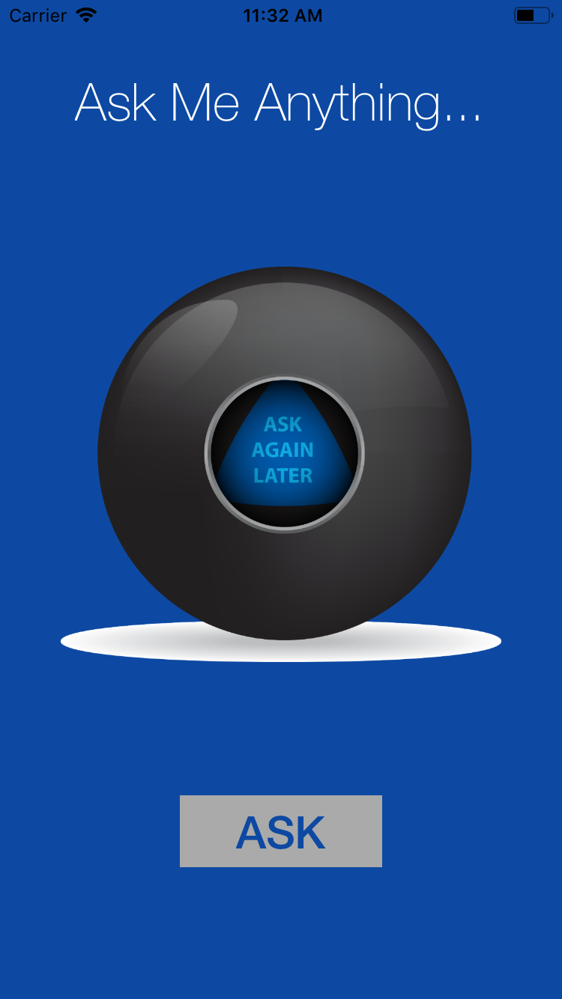

# Magic8Ball
Simple iOS App 

Simple app coded from ios bootcamp challenge

Technologies:
  * XCode Storyboard
  * UILabel
  * UIImageView
  * Swift functions, arrays, variables, constants
  * Motion detection(shake)
